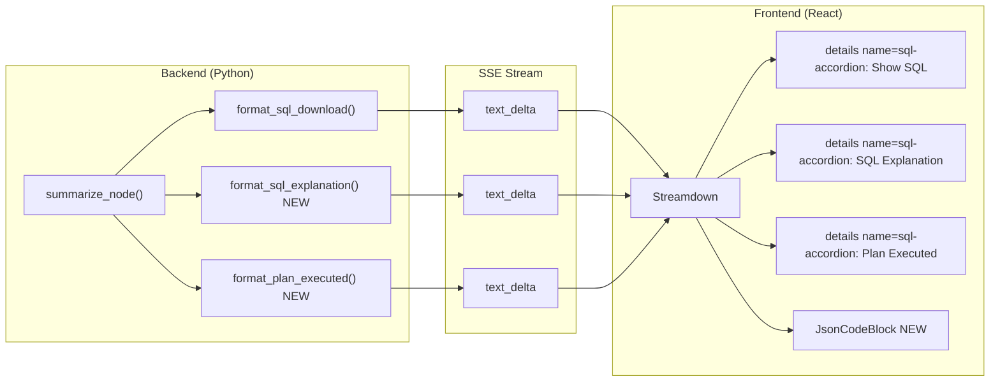

# Accordion Collapsible Sections: SQL Explanation + Plan Executed

## Architecture

The current "Show SQL" section is generated as raw HTML (`<details><summary>Show SQL</summary>...`) in the Python backend and streamed as text to the React frontend, which renders it via Streamdown. We follow the same pattern for the two new sections.

**Key insight**: The native HTML `<details name="group-name">` attribute creates exclusive accordion behavior without any JavaScript -- opening one `<details>` in the group automatically closes the others. All three sections will share `name="sql-accordion"`.




## Backend Changes

### 1. `[summarize_agent.py](agent_app/agent_server/multi_agent/agents/summarize_agent.py)` -- Add two new static methods and modify existing

**Modify `format_sql_download()`** (line 93): Add `name="sql-accordion"` to the `<details>` tag:

```python
parts: list[str] = ["\n\n---\n\n<details name=\"sql-accordion\"><summary>Show SQL</summary>\n"]
```

**Add `format_sql_explanation()` static method**: Generates a `<details name="sql-accordion">` section containing the SQL explanation text as markdown. Prepend with an ordered list of query labels/indices so each SQL query is easy to track:

```python
@staticmethod
def format_sql_explanation(explanation: str, labels: List[str] | None = None) -> str:
    if not explanation:
        return ""
    parts = ['\n<details name="sql-accordion"><summary>SQL Explanation</summary>\n\n']
    if labels:
        for idx, label in enumerate(labels):
            if label:
                parts.append(f"**{idx + 1}. {label}**\n\n")
    parts.append(explanation)
    parts.append("\n\n</details>\n")
    return "".join(parts)
```

**Add `format_plan_executed()` static method**: Generates a `<details name="sql-accordion">` section containing the plan dict as a JSON code block using the `json-download:` custom language tag (same pattern as `sql-download:`) for copy/download:

```python
@staticmethod
def format_plan_executed(plan: dict) -> str:
    if not plan:
        return ""
    import base64
    plan_json = ResultSummarizeAgent._safe_json_dumps(plan, indent=2)
    encoded = base64.b64encode(plan_json.encode()).decode()
    meta = f"plan.json:{encoded}"
    return (
        '\n<details name="sql-accordion"><summary>Plan Executed</summary>\n\n'
        f"

```json-download:{meta}\n{plan_json}\n

```\n"
        "\n</details>\n"
    )
```

### 2. `[summarize.py](agent_app/agent_server/multi_agent/agents/summarize.py)` -- Emit new sections in `summarize_node()`

After the existing SQL download block (lines 448-458), add two new sections:

```python
# --- 3b. SQL Explanation (collapsible, streamed as delta) ---
explanation = state.get("sql_synthesis_explanation", "")
if explanation:
    explanation_block = ResultSummarizeAgent.format_sql_explanation(explanation, labels)
    summary += explanation_block
    writer({"type": "text_delta", "content": explanation_block})

# --- 3c. Plan Executed (collapsible, streamed as delta) ---
plan = state.get("plan")
if plan:
    plan_block = ResultSummarizeAgent.format_plan_executed(plan)
    summary += plan_block
    writer({"type": "text_delta", "content": plan_block})
```

This uses the same `labels` variable already in scope from line 452 and `state` from the node function.

## Frontend Changes

### 3. `[response.tsx](agent_app/e2e-chatbot-app-next/client/src/components/elements/response.tsx)` -- Add `JsonCodeBlock` component

Add a `JsonCodeBlock` component (modeled after the existing `SqlCodeBlock` at lines 21-57) with copy and download buttons:

```tsx
function JsonCodeBlock({ json, filename, b64 }: { json: string; filename: string; b64: string }) {
  const [copied, setCopied] = useState(false);
  const handleCopy = useCallback(() => {
    navigator.clipboard.writeText(json).then(() => {
      setCopied(true);
      setTimeout(() => setCopied(false), 2000);
    });
  }, [json]);
  return (
    <div className="my-1 overflow-hidden rounded-md border ...">
      <div className="flex items-center justify-between bg-zinc-100 px-3 py-1.5 dark:bg-zinc-800">
        <span className="text-xs font-medium ...">JSON</span>
        <div className="flex gap-2">
          <button onClick={handleCopy} ...>{copied ? 'Copied' : 'Copy'}</button>
          <a href={`data:application/json;base64,${b64}`} download={filename} ...>Download</a>
        </div>
      </div>
      <pre className="overflow-x-auto ..."><code>{json}</code></pre>
    </div>
  );
}
```

### 4. `[response.tsx](agent_app/e2e-chatbot-app-next/client/src/components/elements/response.tsx)` -- Handle `json-download:` in code component

In the `EChartsCodeBlock` function (line 59), add a branch for `language-json-download:` (after the existing `language-sql-download:` branch at line 77):

```tsx
if (className?.startsWith('language-json-download:') && children) {
  const meta = className.slice('language-json-download:'.length);
  const colonIdx = meta.indexOf(':');
  if (colonIdx !== -1) {
    const filename = meta.substring(0, colonIdx);
    const b64 = meta.substring(colonIdx + 1);
    return <JsonCodeBlock json={children} filename={filename} b64={b64} />;
  }
}
```

## No Other Frontend Changes Needed

- The native `<details name="sql-accordion">` attribute handles the accordion behavior (only one open at a time) automatically -- no React state management or JavaScript needed.
- The existing `processed` useMemo logic in `Response` (lines 160-187) correctly targets only the first `</details>` (Processing Steps), so the new accordion `<details>` blocks at the end won't interfere.
- Streamdown already passes through HTML attributes (`<details open>` works today), so `name="sql-accordion"` will be preserved.

## Data Availability Summary


| Section         | State field                       | Available at `summarize_node`        |
| --------------- | --------------------------------- | ------------------------------------ |
| Show SQL        | `sql_queries`, `sql_query_labels` | Yes (already used)                   |
| SQL Explanation | `sql_synthesis_explanation`       | Yes (in `extract_summarize_context`) |
| Plan Executed   | `plan`                            | Yes (needs to be read from state)    |


