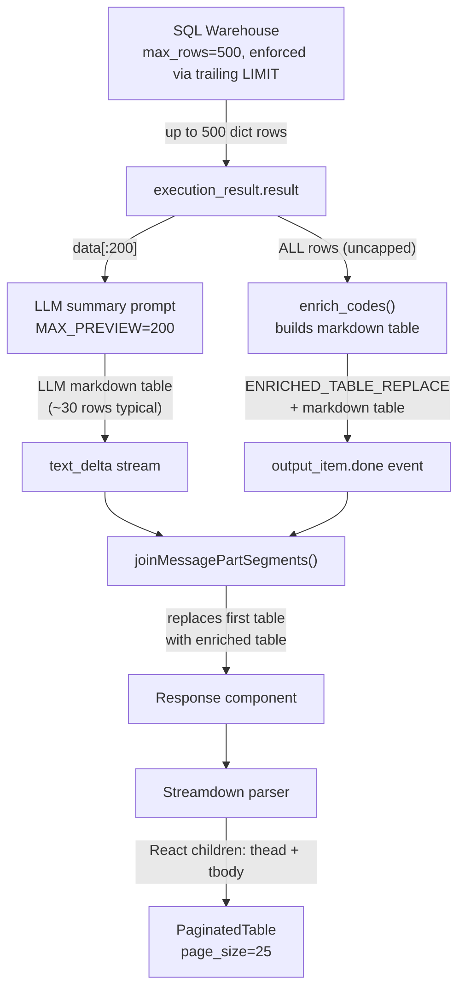
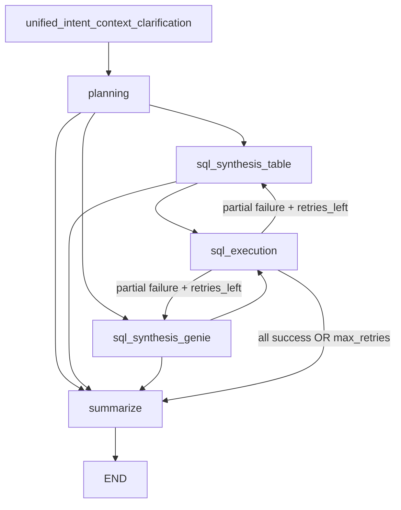
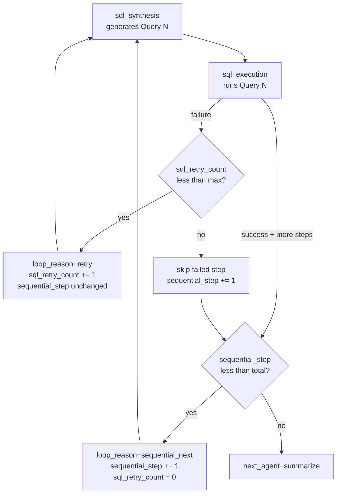

# Multi-Query Strategy, Table Pagination, and Retry Loop

## Data flow and row/size limits

The table data the frontend receives originates from two paths:




**Three row limit layers:**

- **Layer 1 -- SQL execution:** `max_rows=500` safety net (LIMIT appended/enforced at end of query)
- **Layer 2 -- LLM preview:** `MAX_PREVIEW=200` rows shown to the summarizer LLM
- **Layer 3 -- Frontend pagination:** `PaginatedTable` shows 25 rows per page regardless of total

---

## 1. Raise `MAX_PREVIEW_ROWS` and SQL `max_rows` (backend)

### a. LLM preview rows

The LLM summarizer sees only 20 rows, hiding most data in cross-join results. Two files define independent constants:

- [summarize.py](agent_app/agent_server/multi_agent/agents/summarize.py) -- `MAX_PREVIEW_ROWS = 20` (line 228), `MAX_JSON_CHARS = 2000` (line 229)
- [summarize_agent.py](agent_app/agent_server/multi_agent/agents/summarize_agent.py) -- `MAX_PREVIEW = 20` (line 141), `MAX_JSON = 2000` (line 142)

**Change:** Raise both to `MAX_PREVIEW_ROWS / MAX_PREVIEW = 200` and `MAX_JSON_CHARS / MAX_JSON = 20000`.

### b. SQL execution max_rows

- [sql_execution_agent.py](agent_app/agent_server/multi_agent/agents/sql_execution_agent.py) -- `max_rows: int = 100` on lines 89, 297, 364
- [sql_execution.py](agent_app/agent_server/multi_agent/agents/sql_execution.py) -- `max_rows = 100` on line 161

**Change:** Raise default to `500`. Also fix the LIMIT enforcement regex to only match a **trailing** LIMIT (not inner CTE LIMITs):

```python
# Match only trailing LIMIT at end of statement, not inside CTEs/subqueries
trailing_limit = re.search(r"\s+LIMIT\s+(\d+)(?:\s+OFFSET\s+\d+)?\s*$", sql, re.IGNORECASE)
```

Add a post-execution safety truncation: if `len(results) > max_rows`, truncate.

### c. Refactor enrich_codes() to "Code Reference" section (no longer replaces table)

Currently `enrich_codes()` builds a full replacement markdown table from ALL result rows and sends it as `ENRICHED_TABLE_REPLACE`, which replaces the LLM-generated summary table in the frontend. This is redundant now that the LLM summary prompt already annotates coded columns.

**New behavior:** `enrich_codes()` will produce a **compact code reference lookup** -- a small markdown table mapping each unique code to its API-verified description. This is appended **below** the main summary as a collapsible reference section, not a replacement.

**Files to change:**

- [web_search.py](agent_app/agent_server/multi_agent/tools/web_search.py) -- Modify `enrich_codes()`:
  - Instead of iterating all data rows to build a full table, just build a **lookup table** per coded column: `| Code | Description |`
  - Only include unique code values (already capped at `_MAX_CODES_TO_LOOKUP = 30`)
  - Return format changes from a full markdown table to a collapsible section:

```markdown
    <details><summary>Code Reference</summary>

    **NDC Codes**
    | Code | Description |
    |---|---|
    | 69911086902 | Hemlibra 150mg/ml Injection |
    ...

    **ICD-10 Codes**
    | Code | Description |
    |---|---|
    | D68311 | Acquired hemophilia |
    ...
    </details>
    

```

- [summarize.py](agent_app/agent_server/multi_agent/agents/summarize.py) -- In `summarize_node()`, change how the enrichment result is sent:
  - Replace `writer({"type": "code_enrichment", "enriched_table": enriched_table})` with `writer({"type": "text_delta", "content": enriched_ref})` to append it as a text delta after the summary, instead of a separate replacement event
- [agent.py](agent_app/agent_server/agent.py) -- Remove the `code_enrichment` event type handler (lines 415-422) since we no longer use `ENRICHED_TABLE_REPLACE`
- [response.tsx](agent_app/e2e-chatbot-app-next/client/src/components/elements/response.tsx) -- Remove the `ENRICHED_TABLE_REPLACE` sentinel processing logic (lines 164-185) since it is no longer needed

---

## 2. Paginated table-wrapper in the frontend

**Current state:** The `Response` component in [response.tsx](agent_app/e2e-chatbot-app-next/client/src/components/elements/response.tsx) passes markdown to Streamdown with only `a` and `code` component overrides. Streamdown renders tables via its built-in `table-wrapper` div, but no pagination.

**What data the component receives:** Streamdown parses the markdown table into React elements and passes them as `props.children` to the `table` component. The children are `<thead>` and `<tbody>` elements containing `<tr>` rows. All rows are pre-parsed -- there is no data fetching. The component's job is to show/hide rows.

**Approach:** Override the `table` component in the Streamdown `components` prop.

**Key files:**

- Create new component in `client/src/components/elements/paginated-table.tsx`
- Modify [response.tsx](agent_app/e2e-chatbot-app-next/client/src/components/elements/response.tsx) to add `table: PaginatedTable` to `components`

**PaginatedTable behavior:**

- Extract `<thead>` and `<tbody>` from `props.children`
- Extract `<tr>` rows from `<tbody>.props.children` using `React.Children.toArray()`
- If total rows <= 25, render as-is (no pagination overhead for small tables)
- If total rows > 25, paginate:
  - State: `currentPage` (starts at 0)
  - Slice: `rows.slice(page * PAGE_SIZE, (page + 1) * PAGE_SIZE)`
  - Render header, pagination controls, visible rows
  - Show "Rows X-Y of Z" with prev/next buttons
- Wrap in `data-streamdown="table-wrapper"` div so Streamdown's copy/download toolbar still works
- Apply `overflow-x-auto` for horizontal scroll on wide tables

---

## 3. Add multi-query preference for "top N x details" questions

The SQL synthesis agents already have a `MULTI-QUERY STRATEGY` section, but it is too permissive -- the LLM still generates a single monolithic CTE for "top N + their details" queries.

**Key constraint:** All queries are generated in a single LLM call and executed in parallel. Query 2 cannot see Query 1's actual results. Therefore the prompt must instruct the agent to make each query **self-contained** by embedding the top-N selection logic as a subquery.

**Files to change:**

- [sql_synthesis_agents.py](agent_app/agent_server/multi_agent/agents/sql_synthesis_agents.py) -- Both `SQLSynthesisTableAgent.__init`__ system prompt (~~line 226) and `SQLSynthesisGenieAgent._create_sql_synthesis_agent` system prompt (~~line 712)

**Replace the existing MULTI-QUERY STRATEGY section in both prompts with:**

```
## MULTI-QUERY STRATEGY:
- If the question has multiple parts (sub_questions) and you think it's better to report
  each query and result separately instead of combining into one big complex query:
  * Generate MULTIPLE separate SQL queries (one per sub-question)
  * This is preferred when: sub-questions are independent, results are easier to interpret
    separately, or combining would create overly complex SQL
- If sub-questions are closely related and naturally combine (e.g., same table, similar filters):
  * You may generate a single combined SQL query

- CRITICAL RULE for "top N items + their details" patterns:
  When the question asks for "top N items and their associated details"
  (e.g., "top 10 medicines and their diagnoses", "top 5 providers and their procedures"),
  you MUST use multiple separate SQL queries:
  * Query 1: The top N items with their aggregate metric (e.g., top 10 by total cost)
  * Query 2+: For each detail dimension, a separate query
  * IMPORTANT: Each query must be SELF-CONTAINED and independently executable.
    If Query 2 needs the same top-N list as Query 1, embed the top-N selection
    as a subquery or CTE within Query 2 -- do NOT reference Query 1's results.
    Example for "top 10 medicines and their diagnoses":
    

```sql
    -- Query 1: Top 10 medicines by total cost
    SELECT ndc, SUM(paid) AS total_cost FROM pharmacy GROUP BY ndc ORDER BY total_cost DESC LIMIT 10;
    

```

```sql
    -- Query 2: Diagnoses for patients on those top 10 medicines
    WITH top_meds AS (
      SELECT ndc FROM pharmacy GROUP BY ndc ORDER BY SUM(paid) DESC LIMIT 10
    )
    SELECT t.ndc, d.diagnosis_code, COUNT(*) AS cnt
    FROM pharmacy p
    JOIN top_meds t ON p.ndc = t.ndc
    JOIN diagnosis d ON p.patient_id = d.patient_id
    GROUP BY t.ndc, d.diagnosis_code
    ORDER BY t.ndc, cnt DESC;
    

```

- This avoids a single cross-join that explodes rows
(e.g., 10 medicines x 362 diagnoses = 3,620 rows in one result set)
and lets each result be summarized clearly.
- NEVER combine top-N aggregation with detail expansion in a single query.

```

---

## 4. Retry loop: sql_execution -> sql_synthesis (with multi-query context)

**Current state:** The graph has a fixed edge from `sql_execution` to `summarize` ([graph.py](agent_app/agent_server/multi_agent/core/graph.py) line 123). There is no way to loop back.

**Approach:** On failure, retry only the failed queries by routing back to synthesis with full context from successful queries. Uses a `loop_reason` field to disambiguate retry from sequential continuation (Section 5).



**Implementation:**

### a. Add state fields to [state.py](agent_app/agent_server/multi_agent/core/state.py)

```python
# In AgentState -- retry fields
sql_retry_count: Optional[int]           # retries used for current step (0 = first attempt)
sql_retry_max: Optional[int]             # max retries per step (default 1)
sql_retry_feedback: Optional[str]        # structured feedback for synthesis agent
loop_reason: Optional[str]               # "retry" | "sequential_next" | None
preserved_results: Optional[list]        # successful results carried across retries

# Sequential mode fields
execution_mode: Optional[str]            # "parallel" | "sequential"
sequential_step: Optional[int]           # current step index (0-based)
total_sub_questions: Optional[int]       # set by planning_node from len(sub_questions)

# UI override fields
force_synthesis_route: Optional[str]     # "auto" | "table_route" | "genie_route"
```

`RESET_STATE_TEMPLATE` defaults:

```python
"sql_retry_count": 0,
"sql_retry_max": 1,
"sql_retry_feedback": None,
"loop_reason": None,
"preserved_results": [],
"execution_mode": "parallel",
"sequential_step": 0,
"total_sub_questions": 0,
"force_synthesis_route": "auto",
```

### b. Modify sql_execution_node -- parallel mode retry in [sql_execution.py](agent_app/agent_server/multi_agent/agents/sql_execution.py)

**First pass** (all queries executed in parallel):

```python
execution_results = agent.execute_sql_parallel(sql_queries)
successes = [r for r in execution_results if r.get("success")]
failures = [r for r in execution_results if not r.get("success")]

if not failures:
    # All succeeded -- clean up and go to summarize
    return {
        "execution_results": execution_results,
        "preserved_results": [],
        "sql_retry_feedback": None,
        "loop_reason": None,
        "next_agent": "summarize",
    }

if state.get("sql_retry_count", 0) < state.get("sql_retry_max", 1):
    # Partial/full failure with retries left
    return {
        "execution_results": execution_results,  # keep full list for reference
        "preserved_results": successes,           # explicit list of good results
        "sql_retry_count": state.get("sql_retry_count", 0) + 1,
        "sql_retry_feedback": _build_retry_feedback(successes, failures),
        "loop_reason": "retry",
        "next_agent": state.get("join_strategy_route"),  # original synthesis route
    }

# Retries exhausted -- go to summarize with whatever we have
return {
    "execution_results": execution_results,
    "preserved_results": [],
    "sql_retry_feedback": None,
    "loop_reason": None,
    "next_agent": "summarize",
}
```

**Second pass** (retry -- only the regenerated failed queries come through):

```python
preserved = state.get("preserved_results", [])

# Skip-if-already-succeeded guard: if synthesis accidentally regenerated
# a query that matches an already-successful result, skip re-execution
new_queries = _filter_out_already_succeeded(sql_queries, preserved)

new_results = agent.execute_sql_parallel(new_queries) if new_queries else []

# Merge: preserved successes + new results
merged = preserved + new_results

return {
    "execution_results": merged,
    "preserved_results": [],         # clear -- no longer needed
    "sql_retry_feedback": None,      # clear stale feedback
    "loop_reason": None,
    "next_agent": "summarize",       # done regardless of new results
}
```

The `_filter_out_already_succeeded()` helper compares query labels (comment line) and skips duplicates. This is a safety net -- the primary mechanism is the LLM instruction in the retry feedback.

### c. Modify sql_synthesis nodes in [sql_synthesis.py](agent_app/agent_server/multi_agent/agents/sql_synthesis.py)

Check `loop_reason` and `sql_retry_feedback` in state:

```python
loop_reason = state.get("loop_reason")
feedback = state.get("sql_retry_feedback")

if loop_reason == "retry" and feedback:
    # Prepend retry context: error details + successful results
    prompt_prefix = f"RETRY CONTEXT:\n{feedback}\n\nOriginal question: {query}"
elif loop_reason == "sequential_next" and feedback:
    # Prepend sequential continuation context (see Section 5)
    prompt_prefix = f"SEQUENTIAL CONTEXT:\n{feedback}\n\nOriginal question: {query}"
else:
    prompt_prefix = query  # normal first-pass
```

This deterministic branch ensures the synthesis agent receives the correct framing.

### d. Replace the fixed edge in [graph.py](agent_app/agent_server/multi_agent/core/graph.py)

Replace:

```python
workflow.add_edge("sql_execution", "summarize")
```

With:

```python
def route_after_execution(state: AgentState) -> str:
    next_agent = state.get("next_agent", "summarize")
    if next_agent in ("sql_synthesis_table", "sql_synthesis_genie"):
        return next_agent
    return "summarize"

workflow.add_conditional_edges(
    "sql_execution",
    route_after_execution,
    {
        "sql_synthesis_table": "sql_synthesis_table",
        "sql_synthesis_genie": "sql_synthesis_genie",
        "summarize": "summarize",
    },
)
```

### e. Retry feedback format

```
## Retry Context (attempt 2 of 2)

### Successfully executed queries (DO NOT regenerate these):
Query 1 [Top 10 medicines by cost]: 10 rows returned
SQL: SELECT ndc, SUM(paid) ... LIMIT 10;
Columns: ndc, total_cost, patient_count
Sample: [{"ndc": "69911086902", "total_cost": 2556912.68, ...}, ...]

### Failed queries (regenerate these):
Query 2 [Diagnoses for top medicines]: FAILED
SQL: SELECT ndc, diagnosis_code ... FROM nonexistent_table ...
Error: TABLE_OR_VIEW_NOT_FOUND: Table 'nonexistent_table' not found

### Instructions:
- Only regenerate the FAILED queries. The successful queries will be kept.
- Use the successful query results above as context (column names, sample data).
- Fix the error and generate corrected SQL.
- Each regenerated query must be self-contained (include its own subqueries/CTEs).
```

### Why not retry inside the summarize node?

The summarize node is a pure presentation layer. Adding SQL regeneration there would mix concerns, bloat the prompt, and lose the benefit of the synthesis agents' tool-calling capabilities. The retry loop through the graph keeps each node focused.

---

## 5. Sequential execution mode for dependent multi-query

When Query 2 genuinely depends on Query 1's results (e.g., "find the outliers, then explain WHY they're outliers"), parallel execution cannot work. This adds an optional **sequential mode** where the graph loops `sql_synthesis -> sql_execution` one query at a time, feeding each result into the next synthesis step.

**This mode is toggled via a UI switch** (see Section 6) and only matters for multi-query scenarios. Single queries always execute directly.

### Execution flow (sequential with per-step retry)




### Key design rules

1. `**loop_reason` disambiguates retry from continuation.** The synthesis node checks `loop_reason` to decide its prompt strategy -- "fix this error" vs "generate the next query using prior results."
2. `**sql_retry_count` only increments on failure.** It resets to 0 when advancing to the next step. This ensures each step gets its own independent retry budget.
3. `**total_sub_questions`** is set by `planning_node` from `len(plan["sub_questions"])`. The execution node compares `sequential_step >= total_sub_questions` for termination.
4. `**preserved_results`** accumulates across sequential steps (same field used for parallel retry). Each successful result is appended.

### Implementation

**a. State fields:** Already defined in Section 4a. Key sequential fields: `execution_mode`, `sequential_step`, `total_sub_questions`.

**b. `planning_node` sets `total_sub_questions`** in [planning.py](agent_app/agent_server/multi_agent/agents/planning.py):

```python
plan = planning_agent.create_execution_plan(...)
sub_questions = plan.get("sub_questions", [])
return {
    ...
    "total_sub_questions": len(sub_questions),
    "sub_questions": sub_questions,
}
```

**c. sql_execution_node -- sequential mode logic** in [sql_execution.py](agent_app/agent_server/multi_agent/agents/sql_execution.py):

```python
execution_mode = state.get("execution_mode", "parallel")

if execution_mode == "sequential" and len(sql_queries) >= 1:
    result = agent.execute_sql(sql_queries[0], max_rows=500)
    preserved = list(state.get("preserved_results", []))
    step = state.get("sequential_step", 0)
    total = state.get("total_sub_questions", 1)
    retry_count = state.get("sql_retry_count", 0)
    retry_max = state.get("sql_retry_max", 1)
    route = state.get("join_strategy_route")

    if result.get("success"):
        # SUCCESS -- append result, advance step, reset retry budget
        preserved.append(result)
        next_step = step + 1

        if next_step >= total:
            return {
                "execution_results": preserved,
                "preserved_results": [],
                "sql_retry_feedback": None,
                "loop_reason": None,
                "next_agent": "summarize",
            }
        else:
            return {
                "preserved_results": preserved,
                "sequential_step": next_step,
                "sql_retry_count": 0,
                "sql_retry_feedback": _build_sequential_feedback(
                    preserved, step=next_step, total=total
                ),
                "loop_reason": "sequential_next",
                "next_agent": route,
            }
    else:
        # FAILURE
        if retry_count < retry_max:
            return {
                "preserved_results": preserved,
                "sql_retry_count": retry_count + 1,
                "sql_retry_feedback": _build_retry_feedback(preserved, [result]),
                "loop_reason": "retry",
                "next_agent": route,
                # sequential_step unchanged -- stay on same step
            }
        else:
            # Retry exhausted -- skip this step, try next
            next_step = step + 1
            if next_step >= total:
                return {
                    "execution_results": preserved,
                    "preserved_results": [],
                    "sql_retry_feedback": None,
                    "loop_reason": None,
                    "next_agent": "summarize",
                }
            else:
                return {
                    "preserved_results": preserved,
                    "sequential_step": next_step,
                    "sql_retry_count": 0,
                    "sql_retry_feedback": _build_sequential_feedback(
                        preserved, step=next_step, total=total
                    ),
                    "loop_reason": "sequential_next",
                    "next_agent": route,
                }
```

**d. sql_synthesis nodes -- adaptive planning** in [sql_synthesis.py](agent_app/agent_server/multi_agent/agents/sql_synthesis.py):

The synthesis agent treats `sub_questions` as soft guidance, not a rigid checklist. Based on prior results, it can:

- **Skip** a sub-question if prior results already answered it
- **Modify** the next query based on what it learned (e.g., use exact values from prior results)
- **Signal early completion** by returning `NO_MORE_QUERIES` instead of SQL if all remaining questions are already addressed

When `loop_reason == "sequential_next"`:

```python
feedback = state.get("sql_retry_feedback")
step = state.get("sequential_step", 0)
sub_questions = state.get("sub_questions", [])
remaining = sub_questions[step:] if step < len(sub_questions) else []

prompt_prefix = (
    f"SEQUENTIAL CONTEXT:\n{feedback}\n\n"
    f"### Remaining sub-questions (soft guidance, not rigid):\n"
    + "\n".join(f"  {i+1}. {q}" for i, q in enumerate(remaining))
    + "\n\n"
    f"Based on the previous results above, decide what to do next:\n"
    f"- If the next sub-question is already answered by prior results, skip it.\n"
    f"- If you can write a better query using data from prior results "
    f"(e.g., exact codes, IDs), do so.\n"
    f"- If ALL remaining questions are already addressed, return the "
    f"special marker: NO_MORE_QUERIES\n"
    f"- Otherwise, generate ONLY ONE query for the most relevant "
    f"next sub-question.\n"
    f"- The query must be independently executable "
    f"(no temp tables from prior queries)."
)
```

When `loop_reason == "retry"` (same logic for both parallel and sequential):

```python
prompt_prefix = (
    f"RETRY CONTEXT:\n{feedback}\n\n"
    f"Fix the failed query and regenerate."
)
```

**e. Early completion signal:**

When the synthesis agent returns `NO_MORE_QUERIES` instead of SQL, the synthesis node detects this and sets:

```python
if agent_output_is_no_more_queries(result):
    return {
        "sql_queries": [],
        "next_agent": "summarize",
        "loop_reason": None,
        "sql_retry_feedback": None,
    }
```

The execution node also handles the empty `sql_queries` case:

```python
if not sql_queries:
    preserved = list(state.get("preserved_results", []))
    return {
        "execution_results": preserved,
        "preserved_results": [],
        "sql_retry_feedback": None,
        "loop_reason": None,
        "next_agent": "summarize",
    }
```

This two-layer guard ensures early termination works whether the synthesis node or execution node catches the signal.

**f. Sequential continuation feedback format:**

```
## Sequential Step 2 of 3

### Previous results:
Query 1 [Top 10 medicines by cost]: 10 rows returned
SQL: SELECT ndc, SUM(paid) AS total_cost FROM pharmacy GROUP BY ndc ORDER BY total_cost DESC LIMIT 10;
Columns: ndc, total_cost
Data: [{"ndc": "69911086902", "total_cost": 2556912.68}, {"ndc": "54321012345", ...}, ...]

### Remaining sub-questions (adapt as needed):
  1. For each of the top 10 medicines, what are the most common diagnoses?
  2. What are the average patient ages for each top medicine?

### Instructions:
- Review the previous results. If any remaining question is already answered, skip it.
- You may adapt or combine remaining questions based on what you learned.
- Generate ONLY ONE query for the most relevant next sub-question.
- You can reference specific values from previous results (e.g., exact NDC codes).
- The query must be independently executable (no temp tables from prior queries).
- If ALL remaining questions are addressed by prior results, return: NO_MORE_QUERIES
```

**g. Graph routing:** The same conditional edge from Section 4d handles both retry and sequential loops -- `route_after_execution` routes to synthesis whenever `next_agent` is set to a synthesis node, regardless of `loop_reason`.

### Interaction matrix: execution_mode x outcome

- **parallel / all succeed**: `loop_reason=None`, `next_agent=summarize`
- **parallel / partial fail, retries left**: `loop_reason=retry`, `sql_retry_count += 1`, `next_agent=synthesis`
- **parallel / partial fail, retries exhausted**: `loop_reason=None`, `next_agent=summarize`
- **sequential / step succeeds, more steps**: `loop_reason=sequential_next`, `sql_retry_count=0`, `sequential_step += 1`, `next_agent=synthesis`
- **sequential / step succeeds, last step**: `loop_reason=None`, `next_agent=summarize`
- **sequential / step fails, retries left**: `loop_reason=retry`, `sql_retry_count += 1`, `sequential_step unchanged`, `next_agent=synthesis`
- **sequential / step fails, retries exhausted, more steps**: `loop_reason=sequential_next`, `sql_retry_count=0`, `sequential_step += 1`, `next_agent=synthesis`
- **sequential / step fails, retries exhausted, last step**: `loop_reason=None`, `next_agent=summarize`
- **sequential / synthesis returns NO_MORE_QUERIES**: `sql_queries=[]`, `loop_reason=None`, `next_agent=summarize` (early completion -- synthesis determined remaining sub-questions are already answered by prior results)

---

## 6. UI settings panel with toggles

The frontend currently has no `custom_inputs` mechanism. We need to thread two user-controlled settings from the UI through to the backend agent:

1. **Execution mode:** "Parallel" (default) vs "Sequential" -- controls whether multi-query results execute all-at-once or one-at-a-time with intermediate results feeding back
2. **Synthesis route override:** "Auto" (default, LLM decides) vs "Table route" (force UC functions) vs "Genie route" (force Genie agents)

### Data flow for settings

```mermaid
flowchart LR
  UI["Settings Panel<br/>(toggles)"] -->|"agentSettings in body"| Schema["postRequestBodySchema<br/>(new optional field)"]
  Schema -->|"parsed in chat handler"| Headers["custom x-headers<br/>on streamText"]
  Headers -->|"injected into body.custom_inputs"| Provider["providers-server.ts<br/>databricksFetch"]
  Provider -->|"request.custom_inputs"| Agent["agent.py<br/>stream_handler"]
  Agent -->|"initial_state fields"| Graph["LangGraph workflow<br/>(AgentState)"]
```




### a. Frontend: settings panel component

Create `client/src/components/agent-settings.tsx`:

- A collapsible panel (or popover) accessible from the chat input area
- Two controls:
  - **Execution mode**: Toggle switch -- "Sequential execution" (off = parallel, on = sequential)
  - **Synthesis route**: Three-way selector -- "Auto" / "Table route" / "Genie route"
- State persisted to `localStorage` (keys: `agent:execution-mode`, `agent:synthesis-route`)
- Values exposed via a React context or passed as props to the chat component

Install `@radix-ui/react-switch` for the toggle (not currently a dependency).

### b. Frontend: thread settings into chat request

Modify [chat.tsx](agent_app/e2e-chatbot-app-next/client/src/components/chat.tsx) `prepareSendMessagesRequest`:

```typescript
prepareSendMessagesRequest({ messages, id, body }) {
  // ... existing logic ...
  return {
    body: {
      // ... existing fields ...
      agentSettings: {
        executionMode: executionMode,      // "parallel" | "sequential"
        synthesisRoute: synthesisRoute,    // "auto" | "table_route" | "genie_route"
      },
      ...body,
    },
  };
},
```

### c. Schema: add agentSettings to request body

Modify [chat.ts schema](agent_app/e2e-chatbot-app-next/packages/core/src/schemas/chat.ts):

```typescript
const agentSettingsSchema = z.object({
  executionMode: z.enum(['parallel', 'sequential']).default('parallel'),
  synthesisRoute: z.enum(['auto', 'table_route', 'genie_route']).default('auto'),
}).optional();

export const postRequestBodySchema = z.object({
  // ... existing fields ...
  agentSettings: agentSettingsSchema,
});
```

### d. Server: forward settings as custom headers

Modify [chat.ts handler](agent_app/e2e-chatbot-app-next/server/src/routes/chat.ts) to pass settings as additional headers:

```typescript
const requestHeaders = {
  [CONTEXT_HEADER_CONVERSATION_ID]: id,
  [CONTEXT_HEADER_USER_ID]: session.user.email ?? session.user.id,
  'x-agent-execution-mode': agentSettings?.executionMode ?? 'parallel',
  'x-agent-synthesis-route': agentSettings?.synthesisRoute ?? 'auto',
  // ... existing headers ...
};
```

### e. Provider: inject settings into custom_inputs

Modify [providers-server.ts](agent_app/e2e-chatbot-app-next/packages/ai-sdk-providers/src/providers-server.ts) `databricksFetch` to include agent settings in the body alongside context:

```typescript
const enhancedBody = {
  ...body,
  context: {
    ...body.context,
    conversation_id: conversationId,
    user_id: userId,
  },
  custom_inputs: {
    ...body.custom_inputs,
    execution_mode: headers.get('x-agent-execution-mode') || 'parallel',
    force_synthesis_route: headers.get('x-agent-synthesis-route') || 'auto',
  },
};
```

### f. Backend: read settings from custom_inputs into initial_state

Modify [agent.py](agent_app/agent_server/agent.py) `stream_handler`:

```python
ci = dict(request.custom_inputs or {})
# ... existing thread_id/user_id logic ...

# Agent settings from UI
execution_mode = ci.get("execution_mode", "parallel")
force_synthesis_route = ci.get("force_synthesis_route", "auto")

initial_state = {
    **RESET_STATE_TEMPLATE,
    "original_query": latest_query,
    "execution_mode": execution_mode,
    "force_synthesis_route": force_synthesis_route,
    # ... existing fields ...
}
```

### g. Backend: honor force_synthesis_route in planning_node

Modify [planning.py](agent_app/agent_server/multi_agent/agents/planning.py) `planning_node`:

```python
# After plan = planning_agent.create_execution_plan(...)
force_route = state.get("force_synthesis_route", "auto")
if force_route == "table_route":
    join_strategy = "table_route"
    next_agent = "sql_synthesis_table"
elif force_route == "genie_route":
    join_strategy = "genie_route"
    next_agent = "sql_synthesis_genie"
else:
    # Existing logic: use LLM-determined join_strategy from plan
    join_strategy = plan.get("join_strategy")
    next_agent = "sql_synthesis_genie" if join_strategy == "genie_route" else "sql_synthesis_table"
```

### h. Backend: honor execution_mode in sql_execution_node

The `execution_mode` field in state is read by `sql_execution_node` (Section 5b) to decide between `execute_sql_parallel` and the new sequential loop.