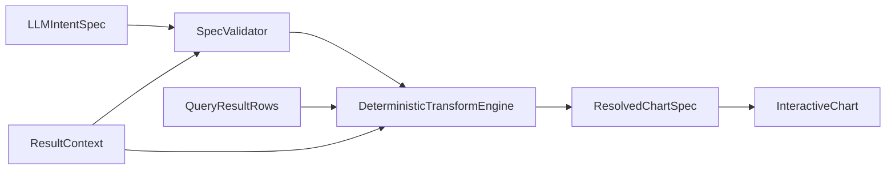

# Richer Declarative Charts

## Goal

Keep Python authoritative for chart data and guardrails, but expand the chart contract from a minimal config to a validated declarative spec that can express richer transforms and presentation safely.

## Current Seams

- Backend chart pipeline lives in `[/Users/yang.yang/CursorProjects/KUMC_POC_hlsfieldtemp/agent_app/agent_server/multi_agent/agents/chart_generator.py](/Users/yang.yang/CursorProjects/KUMC_POC_hlsfieldtemp/agent_app/agent_server/multi_agent/agents/chart_generator.py)`.
- Frontend consumes JSON from `echarts-chart` blocks in `[/Users/yang.yang/CursorProjects/KUMC_POC_hlsfieldtemp/agent_app/e2e-chatbot-app-next/client/src/components/elements/response.tsx](/Users/yang.yang/CursorProjects/KUMC_POC_hlsfieldtemp/agent_app/e2e-chatbot-app-next/client/src/components/elements/response.tsx)` and renders it in `[/Users/yang.yang/CursorProjects/KUMC_POC_hlsfieldtemp/agent_app/e2e-chatbot-app-next/client/src/components/elements/interactive-chart.tsx](/Users/yang.yang/CursorProjects/KUMC_POC_hlsfieldtemp/agent_app/e2e-chatbot-app-next/client/src/components/elements/interactive-chart.tsx)`.
- Tests currently only cover a narrow backend guardrail path in `[/Users/yang.yang/CursorProjects/KUMC_POC_hlsfieldtemp/agent_app/tests/unit/test_sequential_output_fixes.py](/Users/yang.yang/CursorProjects/KUMC_POC_hlsfieldtemp/agent_app/tests/unit/test_sequential_output_fixes.py)`.

Relevant current payload shape:

```81:95:/Users/yang.yang/CursorProjects/KUMC_POC_hlsfieldtemp/agent_app/agent_server/multi_agent/agents/chart_generator.py
            payload = {
                "config": {
                    "chartType": config.get("chartType", "bar"),
                    "title": config.get("title", ""),
                    "xAxisField": config.get("xAxisField"),
                    "groupByField": config.get("groupByField"),
                    "series": config.get("series", []),
                    "toolbox": True,
                },
                "chartData": chart_data,
                "downloadData": download_data,
                "totalRows": len(data),
                "aggregated": aggregated,
                "aggregationNote": agg_note,
            }
```

## Proposed Contract Change

Introduce a richer validated spec with two layers:

- `intentSpec`: what the LLM is allowed to decide.
  - Chart family and presentation hints.
  - Encodings: x, optional group, one or more measures.
  - Transform intent: `topN`, `frequency`, `timeBucket`, `histogram`, `percentOfTotal`, and layout hints like grouped vs stacked.
- `resolvedSpec`: what Python returns to the frontend after validating fields, normalizing unsupported combinations, computing transformed `chartData`, and applying size limits.

Python should:

- Reject or coerce invalid fields/types from the LLM.
- Resolve transform parameters against actual `columns` and sample/full data.
- Produce deterministic `chartData` and `downloadData`.
- Downgrade unsupported chart/layout combinations to safe defaults instead of emitting arbitrary ECharts config.

## LLM And Python Alignment

Treat alignment as a first-class requirement, not prompt hygiene.

Use one shared allowlisted capability model that defines:

- supported chart families
- supported layouts such as grouped, stacked, normalized, dual-axis, and combo
- supported transforms such as `topN`, `frequency`, `timeBucket`, `histogram`, `percentOfTotal`, `rankingSlope`, and `deltaComparison`
- per-chart required and optional fields
- compatible field types and valid chart-transform combinations

Implementation rule:

- the LLM prompt may only reference options that exist in the backend capability model
- Python validation must reject anything outside that same model
- frontend rendering must only consume the backend-resolved allowlisted spec, never raw LLM output

Practical approach:

- define backend enums and compatibility tables first
- generate the prompt examples and allowed option list from that backend model where practical, or keep them adjacent in one module if generation is too heavy
- normalize unsupported LLM choices to a safe fallback and record the downgrade in `aggregationNote` or transform metadata when useful
- add tests that assert prompt-listed options and backend-supported options stay in sync

## Expanded Chart Roadmap

Prioritize richer charts in phases so the contract stays safe and the frontend only grows where the backend can resolve deterministic data correctly.

### Phase 1: highest-value additions

- `stackedBar` for categorical composition such as benefit mix, pay type mix, or utilization by cohort
- `area` and `stackedArea` for time-bucketed trends and composition over time
- `histogram` for cost, age, utilization-count, and length-of-stay distributions
- `heatmap` for dense cross-tabs such as month-by-category or state-by-benefit intensity

### Phase 2: analytical depth

- `boxplot` for distribution and outlier analysis by cohort or category
- `normalizedStackedBar` for percent composition across groups
- `dualAxis` and `combo` layouts with a narrow allowlist, such as bars for volume plus line for spend
- `referenceLines` for median, benchmark, or target overlays
- `rankingSlope` and `deltaComparison` for two-period rank and change analysis across diagnoses, providers, members, or cohorts

### Phase 3: selective advanced views

- `treemap` for hierarchical spend breakdowns
- `facetBy` for capped small-multiples by a limited category field

Out of scope for now:

- arbitrary ECharts options
- user-defined JavaScript formatters
- low-signal chart families like radar unless a concrete use case emerges

## Implementation Steps

### 1. Add backend spec normalization and validation

Update `[/Users/yang.yang/CursorProjects/KUMC_POC_hlsfieldtemp/agent_app/agent_server/multi_agent/agents/chart_generator.py](/Users/yang.yang/CursorProjects/KUMC_POC_hlsfieldtemp/agent_app/agent_server/multi_agent/agents/chart_generator.py)` to separate:

- raw LLM JSON parsing
- spec validation/normalization
- deterministic transform execution
- final payload assembly

Validation should check:

- referenced fields exist in `columns`
- chart type and layout are from a fixed allowlist
- transform-specific required args are present
- series count and bucket/bin/top-N counts are clamped
- `frequency` output rewrites the measure field deterministically so frontend data always matches the spec
- chart-type, layout, and transform combinations match the shared capability model

### 2. Expand deterministic transforms in Python

Implement missing transform handlers in the backend for:

- `timeBucket`
- `histogram`
- `percentOfTotal`
- explicit grouped vs stacked category output shaping
- heatmap matrix shaping
- boxplot summary statistics
- limited combo-series resolution where each series type is allowlisted and generated by Python
- two-period comparison transforms for ranking slope and delta charts

Keep current guardrails:

- repeated-grain dedupe behavior
- `MAX_CHART_POINTS`
- `MAX_DOWNLOAD_ROWS`
- `MAX_JSON_BYTES`

Likely helper shape:

- one transform-dispatch function per transform type
- one normalization function that resolves LLM intent into supported transform config

### 3. Tighten the LLM prompt to target declarative intent only

Revise the prompt in `[/Users/yang.yang/CursorProjects/KUMC_POC_hlsfieldtemp/agent_app/agent_server/multi_agent/agents/chart_generator.py](/Users/yang.yang/CursorProjects/KUMC_POC_hlsfieldtemp/agent_app/agent_server/multi_agent/agents/chart_generator.py)` so the model outputs only the allowlisted declarative fields, with examples for:

- time buckets on dates
- histogram binning on numeric measures
- percent-of-total summaries
- grouped vs stacked categorical comparisons

The model should no longer be treated as trusted for field correctness; it should only propose intent.

Prompt maintenance rule:

- every option named in the prompt must be backed by Python validation and transform support
- every newly added supported option should get at least one prompt example and one backend validation test

### 4. Evolve the frontend renderer to consume the richer safe spec

Update `[/Users/yang.yang/CursorProjects/KUMC_POC_hlsfieldtemp/agent_app/e2e-chatbot-app-next/client/src/components/elements/interactive-chart.tsx](/Users/yang.yang/CursorProjects/KUMC_POC_hlsfieldtemp/agent_app/e2e-chatbot-app-next/client/src/components/elements/interactive-chart.tsx)` to support the expanded resolved spec while keeping rendering deterministic.

Expected frontend changes:

- expand `ChartSpec`/`ChartConfig` types for layout and transform metadata
- add grouped vs stacked series handling
- add percent formatting and any needed axis/tooltip formatting parity
- register only the new ECharts modules needed for the phased roadmap
- support richer but allowlisted series layouts such as area, heatmap, boxplot, normalized stacked, and limited combo views

Update `[/Users/yang.yang/CursorProjects/KUMC_POC_hlsfieldtemp/agent_app/e2e-chatbot-app-next/client/src/components/elements/response.tsx](/Users/yang.yang/CursorProjects/KUMC_POC_hlsfieldtemp/agent_app/e2e-chatbot-app-next/client/src/components/elements/response.tsx)` to defensively parse and reject malformed chart payloads before rendering.

## Test Plan

Extend `[/Users/yang.yang/CursorProjects/KUMC_POC_hlsfieldtemp/agent_app/tests/unit/test_sequential_output_fixes.py](/Users/yang.yang/CursorProjects/KUMC_POC_hlsfieldtemp/agent_app/tests/unit/test_sequential_output_fixes.py)` or add focused backend tests for:

- invalid LLM field references being rejected/coerced
- `timeBucket` monthly rollups
- `histogram` bin generation
- heatmap matrix shaping
- boxplot summary generation
- `frequency` output aligning with resolved measure fields
- grouped vs stacked resolved data shape
- percent-of-total math
- limited combo-series resolution
- ranking slope alignment across two periods
- delta comparison transform math and sorting
- continued dedupe protection for repeated-grain totals
- size guard interactions after transform expansion
- prompt-listed chart options staying in sync with backend-supported options

Add frontend tests around the chart payload parser and option builder for:

- grouped and stacked series rendering
- percent formatting
- heatmap and boxplot option construction
- combo layout rendering with allowlisted series mixes
- dual-axis rendering
- ranking slope and delta comparison rendering
- malformed spec fallback behavior

## Risks To Manage

- `downloadData` currently reflects raw rows, not transformed chart rows; also export resolved chart data too.
- Grouped/stacked behavior should be resolved primarily in Python to avoid frontend alignment bugs from uneven category/group combinations.
- Unknown declarative fields must be ignored or rejected, never passed through as arbitrary ECharts option fragments.
- Advanced chart families should be phased in only when Python can emit a fully resolved data shape for them; the frontend should not infer missing structure.

## Architecture




