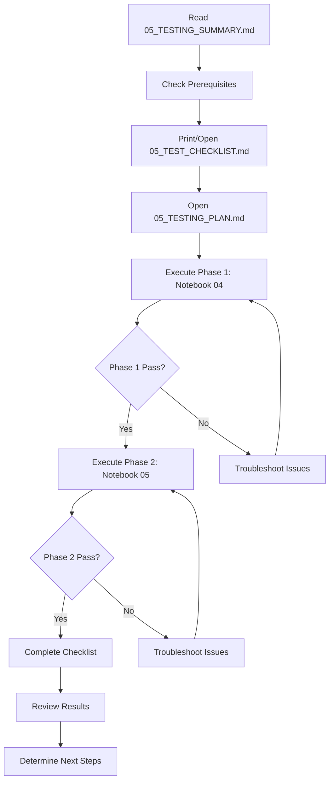
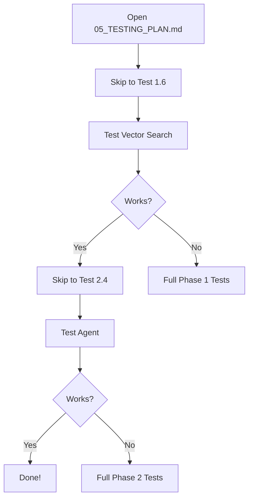

# Notebook Testing Documentation - Quick Start

**Last Updated:** December 4, 2025  
**Status:** 📋 Ready for Testing

---

## 📚 What's Inside This Folder

I've created a complete testing documentation suite for your multi-agent system notebooks:

| Document | Purpose | When to Use |
|----------|---------|-------------|
| **05_README.md** | This file - overview and navigation | Start here |
| **05_TESTING_SUMMARY.md** | Executive summary of testing approach | Quick overview |
| **05_TESTING_PLAN.md** | Detailed step-by-step testing procedures | During testing |
| **05_TEST_CHECKLIST.md** | Printable checklist for tracking progress | During testing |
| **05_NOTEBOOK_ANALYSIS.md** | Databricks syntax analysis and recommendations | Reference |

---

## 🎯 Quick Start: What You Need to Do

### 1. **Right Now: Review the Summary** (5 minutes)
   - Open: `05_TESTING_SUMMARY.md`
   - Understand what will be tested
   - Check your configuration values
   - Note the time estimate (85-110 minutes)

### 2. **Before Testing: Pre-Flight Check** (10 minutes)
   - Open: `05_TESTING_PLAN.md` → Pre-Test Checklist
   - Verify you have:
     - ✅ Databricks workspace access
     - ✅ Source data table exists
     - ✅ Genie spaces are accessible
     - ✅ Model endpoints available

### 3. **During Testing: Follow the Plan** (85-110 minutes)
   - Open: `05_TESTING_PLAN.md`
   - Print or open: `05_TEST_CHECKLIST.md` (for tracking)
   - Execute tests in order:
     1. **Phase 1:** Notebook 04 tests (20-30 min)
     2. **Phase 2:** Notebook 05 tests (30-40 min)
   - Document results as you go

### 4. **After Testing: Review Results** (10 minutes)
   - Complete the checklist
   - Calculate success rate
   - Determine next steps based on results

---

## 🎬 Testing Overview

### What's Being Tested

#### Notebook 04: Vector Search Index
```
✓ Create vector search endpoint
✓ Build delta sync index on enriched docs
✓ Test semantic search with filters
✓ Create Unity Catalog functions for agents
```

**Expected Outcome:** Queryable vector search index with 3 UC functions

#### Notebook 05: Multi-Agent System
```
✓ Import and initialize agent
✓ Test single-space queries
✓ Test cross-domain queries with joins
✓ Test clarification flow
✓ Verify MLflow logging works
```

**Expected Outcome:** Working multi-agent system ready for deployment

---

## 📊 Current Status

### What We Know (from Context7 Analysis)

✅ **Good News:**
- Notebooks use current Databricks syntax
- No breaking changes required
- Code quality is high
- Architecture is sound

⚠️ **Optional Improvements Available:**
- Can modernize agent deployment pattern
- Can update LangGraph version
- See `05_NOTEBOOK_ANALYSIS.md` for details

❓ **Unknown (Need to Test):**
- Does the vector search index build successfully?
- Do the agents work end-to-end?
- Are query results accurate?
- Is performance acceptable?

---

## 📖 Document Guide

### 05_TESTING_SUMMARY.md - Executive Summary
**Purpose:** High-level overview of the testing approach  
**Use When:** You want to understand what's being tested and why  
**Key Sections:**
- What was done (analysis summary)
- Current status of notebooks
- Testing approach overview
- Expected issues and solutions
- Next steps after testing

**Best For:** Managers, quick reviews, understanding the big picture

---

### 05_TESTING_PLAN.md - Detailed Testing Procedures
**Purpose:** Step-by-step instructions for every test  
**Use When:** Actually performing the tests  
**Key Sections:**
- Pre-test checklist (verify prerequisites)
- Phase 1: 8 tests for Notebook 04 (vector search)
- Phase 2: 10 tests for Notebook 05 (multi-agent system)
- Each test includes:
  - Objective
  - Commands to run
  - Expected results
  - Troubleshooting steps

**Best For:** Testers, developers, detailed execution

---

### 05_TEST_CHECKLIST.md - Progress Tracker
**Purpose:** Track what's been tested and results  
**Use When:** During testing to track progress  
**Key Sections:**
- Pre-test verification checkboxes
- Test-by-test pass/fail tracking
- Issues log
- Final assessment
- Sign-off section

**Best For:** Documenting results, reporting progress, auditing

---

### 05_NOTEBOOK_ANALYSIS.md - Syntax Analysis
**Purpose:** Databricks syntax review and recommendations  
**Use When:** Considering updates or modernizations  
**Key Sections:**
- Detailed findings for each component
- Before/after code examples
- Migration recommendations
- Testing recommendations

**Best For:** Developers, planning improvements, understanding best practices

---

## 🚀 Recommended Workflow

### First-Time Testing (Full Process)



**Estimated Time:** 2-2.5 hours (including reading and setup)

---

### Quick Verification (Experienced Users)



**Estimated Time:** 30-45 minutes

---

## ⚡ Quick Reference

### Key Configuration Values

```yaml
Catalog: yyang
Schema: multi_agent_genie

Vector Search:
  Endpoint: vs_endpoint_genie_multi_agent_vs
  Index: yyang.multi_agent_genie.enriched_genie_docs_chunks_vs_index
  Function: yyang.multi_agent_genie.search_genie_spaces

LLM: databricks-claude-sonnet-4-5
Embedding: databricks-gte-large-en

Genie Spaces: 5 configured
  - GENIE_PATIENT
  - MEDICATIONS  
  - GENIE_DIAGNOSIS_STAGING
  - GENIE_TREATMENT
  - GENIE_LABORATORY_BIOMARKERS
```

---

### Success Criteria

✅ **Ready for Production** if:
- [ ] All tests pass (100% success)
- [ ] OR ≥90% success with only low-priority issues
- [ ] Performance acceptable (<30s average query time)
- [ ] Results are accurate

⚠️ **Needs Work** if:
- [ ] 70-89% success rate
- [ ] Some tests fail but system mostly works
- [ ] Performance acceptable but some issues

❌ **Not Ready** if:
- [ ] <70% success rate
- [ ] Critical tests fail (index creation, agent import)
- [ ] System unusable or very slow

---

## 🔧 Troubleshooting Quick Links

### Common Issues

| Issue | See Section |
|-------|-------------|
| Index won't build | Testing Plan → Test 1.4, 1.5 |
| No search results | Testing Plan → Test 1.6 |
| Agent import fails | Testing Plan → Test 2.3 |
| Queries timeout | Testing Summary → Expected Issues #2 |
| Genie spaces error | Testing Summary → Expected Issues #4 |

---

## 📞 Getting Help

### If Tests Fail

1. **Check the troubleshooting section** in the testing plan
2. **Review expected issues** in the testing summary
3. **Document the failure** using the issues log in checklist
4. **Try common solutions** before escalating

### Information to Provide

When requesting help, include:
- [ ] Which test failed
- [ ] Exact error message
- [ ] What you've already tried
- [ ] Completed checklist
- [ ] Screenshots (if helpful)

---

## 📈 After Testing: Next Steps

### If All Tests Pass ✅

1. **Immediate:**
   - [ ] Complete final checklist
   - [ ] Document configuration
   - [ ] Save test results

2. **Optional Improvements:**
   - [ ] Review `05_NOTEBOOK_ANALYSIS.md` for modernization options
   - [ ] Update LangGraph version
   - [ ] Optimize performance

3. **Production Deployment:**
   - [ ] Register model to UC registry
   - [ ] Deploy to serving endpoint
   - [ ] Create user docs
   - [ ] Set up monitoring

### If Tests Fail ⚠️

1. **Document:**
   - [ ] Complete issues log in checklist
   - [ ] Identify failure severity
   - [ ] Note attempted solutions

2. **Remediate:**
   - [ ] Fix critical issues first
   - [ ] Retest failed components
   - [ ] Update documentation

3. **Escalate (if needed):**
   - [ ] Gather all documentation
   - [ ] Describe issue clearly
   - [ ] Share what you've tried

---

## 📝 Final Checklist Before Starting

Before you begin testing, ensure you have:

- [ ] Read this README
- [ ] Reviewed the testing summary
- [ ] Verified prerequisites
- [ ] Allocated 2-2.5 hours for testing
- [ ] Have access to Databricks workspace
- [ ] Opened the testing plan
- [ ] Opened or printed the checklist
- [ ] Have a way to document issues (text editor, notepad)

**✅ Ready?** → Open `05_TESTING_PLAN.md` and begin!

---

## 📚 Additional Resources

### Internal Documentation
- Main README: `../README.md`
- Implementation Status: `../IMPLEMENTATION_STATUS.md`
- Architecture: `../ARCHITECTURE.md`
- Configuration: `../config.py`

### Databricks Documentation
- Vector Search: https://docs.databricks.com/en/generative-ai/vector-search.html
- Agents SDK: https://docs.databricks.com/en/generative-ai/agent-framework/
- MLflow: https://mlflow.org/docs/latest/

### Analysis Source
- Used Context7 MCP with latest Databricks documentation
- Analysis date: December 4, 2025
- All syntax validated against current APIs

---

## 🎯 Summary

**What:** Comprehensive testing for 2 notebooks (vector search + multi-agent system)  
**Why:** Verify everything works before production deployment  
**How:** Follow step-by-step testing plan with detailed procedures  
**When:** Now - system is ready for testing  
**Time:** ~2 hours for first-time testing  
**Outcome:** ✅ Production-ready system or 📋 Action plan for fixes

---

**Ready to start? Open `05_TESTING_SUMMARY.md` next!**

---

_Last updated by Context7 MCP Analysis on December 4, 2025_

