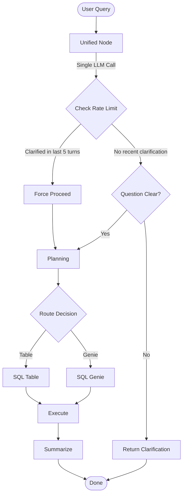

# Unified Intent, Context, and Clarification Agent Implementation

## Summary

Successfully implemented a unified agent that combines intent detection, context generation, and clarification with smart rate limiting (1 per 5 turns) using a single LLM call.

## Changes Made

### 1. Inline TypedDicts (No kumc_poc imports)

**Location:** `Notebooks/Super_Agent_hybrid.py` (after line 559)

Defined inline TypedDicts:
- `ConversationTurn` - Represents a single conversation turn
- `ClarificationRequest` - Unified clarification request object  
- `IntentMetadata` - Intent metadata for business logic
- `AgentState` - Complete agent state definition

Helper functions:
- `create_conversation_turn()` - Factory for ConversationTurn
- `create_clarification_request()` - Factory for ClarificationRequest
- `format_clarification_message()` - Format clarification for display
- `get_reset_state_template()` - Reset per-query fields

**Removed imports:**
```python
# OLD
from kumc_poc.conversation_models import (
    AgentState, ConversationTurn, ClarificationRequest, IntentMetadata, ...
)
from kumc_poc.intent_detection_service import (
    IntentDetectionAgent, create_intent_metadata_from_result, ...
)

# NEW
# All definitions are now inline - no kumc_poc imports
```

### 2. Unified Node Implementation

**Location:** `Notebooks/Super_Agent_hybrid.py` (before line 1969)

**New Functions:**
- `check_clarification_rate_limit(turn_history, window_size=5)` - Sliding window rate limiter
- `unified_intent_context_clarification_node(state)` - Single-LLM-call unified agent

**Key Features:**

1. **Single LLM Prompt** that returns JSON with:
   - `intent_type` (new_question, refinement, continuation)
   - `context_summary` (2-3 sentences for planning agent)
   - `question_clear` (bool)
   - `clarification_reason` and `clarification_options` (if unclear)
   - `metadata` (domain, complexity, topic_change_score)

2. **Rate Limiting Logic:**
   ```python
   # Check if any of last 5 turns triggered clarification
   is_rate_limited = check_clarification_rate_limit(turn_history, window_size=5)
   
   if not question_clear and is_rate_limited:
       # Force proceed to planning
       question_clear = True
       print("⚠ Clarification rate limit reached (1 per 5 turns)")
   ```

3. **Conditional Routing:**
   - If unclear AND not rate-limited → Return clarification to user (END)
   - Otherwise → Proceed to planning

### 3. Workflow Graph Updates

**Location:** `Notebooks/Super_Agent_hybrid.py` in `create_super_agent_hybrid()`

**Removed:**
```python
# OLD
workflow.add_node("intent_detection", intent_detection_node)
workflow.add_node("clarification", clarification_node)
workflow.set_entry_point("intent_detection")
workflow.add_edge("intent_detection", "clarification")
workflow.add_conditional_edges("clarification", route_after_clarification, ...)
```

**Added:**
```python
# NEW
workflow.add_node("unified_intent_context_clarification", unified_intent_context_clarification_node)
workflow.set_entry_point("unified_intent_context_clarification")
workflow.add_conditional_edges("unified_intent_context_clarification", route_after_unified, ...)
```

**New Routing Function:**
```python
def route_after_unified(state: AgentState) -> str:
    """Route after unified node: planning or END (clarification)"""
    if state.get("question_clear", False):
        return "planning"
    return END  # End if clarification needed
```

### 4. Old Nodes Deprecated

The old nodes are renamed with `_OLD` suffix for reference:
- `intent_detection_node` → `intent_detection_node_OLD`
- These nodes still reference the old kumc_poc imports but are not used

## Architecture

### Before (2 Nodes, 2 LLM Calls)
```
START → intent_detection_node → clarification_node → [planning OR END]
         └─ LLM call 1           └─ LLM call 2
```

### After (1 Node, 1 LLM Call)
```
START → unified_intent_context_clarification_node → [planning OR END]
         └─ Single LLM call (intent + context + clarity)
```

## Workflow Flow



## Benefits

1. **Simplified Architecture** - 1 node instead of 2
2. **Faster** - Single LLM call instead of 2 sequential calls
3. **Cheaper** - ~50% reduction in LLM costs for intent/clarification phase
4. **Smart Rate Limiting** - Max 1 clarification per 5 turns (sliding window)
5. **Self-Contained** - No external kumc_poc dependencies
6. **Easier to Debug** - All logic in one place
7. **Maintains Functionality** - Still provides clarification when truly needed

## Rate Limiting Details

### Sliding Window (5 turns)
- Checks if any of the last 5 turns triggered clarification
- If yes → Skip clarification, proceed with best-effort
- If no → Allow clarification if query is unclear

### Example Flow

**Turn 1:** "Show me data" (vague)
- Result: Clarification requested ✓
- `triggered_clarification=True` in turn

**Turn 2:** User clarifies
- Result: Proceeds to planning

**Turn 3:** "Show other stuff" (vague again)
- Check: Turn 1 triggered clarification (within 5-turn window)
- Result: Rate limited, proceeds to planning ✓

**Turns 4-6:** Clear queries
- Result: Normal execution

**Turn 7:** "Show me something" (vague)
- Check: Last clarification was Turn 1 (6 turns ago, outside window)
- Result: Clarification allowed again ✓

## Testing

Use existing test cases in the notebook:

1. **Clear query** - Should proceed directly to planning
2. **Vague query** - Should trigger clarification (if not rate limited)
3. **Two vague queries within 5 turns** - Second should be rate limited
4. **Vague query after 5 clear turns** - Should trigger clarification again
5. **Refinement queries** - Should use context_summary from history
6. **New question detection** - Should correctly identify topic changes

Run the test cells in `Notebooks/Super_Agent_hybrid.py` starting at line 4422.

## Backward Compatibility

- `invoke_super_agent_hybrid()` - Works unchanged
- `respond_to_clarification()` - Works unchanged
- `ask_follow_up_query()` - Works unchanged
- State fields - All preserved (pending_clarification, question_clear, etc.)
- CheckpointSaver - Fully compatible

## Next Steps

1. Run test cells in the notebook to verify functionality
2. Test clarification rate limiting with multiple vague queries
3. Verify context_summary quality in planning phase
4. Monitor LLM call reduction (should see ~50% fewer calls)
5. Consider removing _OLD nodes after verifying stability

## Configuration

No configuration changes needed. The unified node uses the same:
- `LLM_ENDPOINT_CLARIFICATION` - For the unified LLM call
- `TABLE_NAME` - For loading space context
- Rate limit window size is hardcoded to 5 (can be parameterized if needed)
